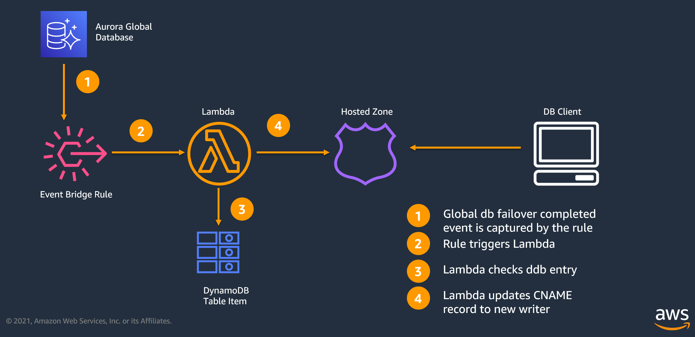

# Automated endpoint management for Amazon Aurora Global Database

This solution includes a cloudformation template and a python script. This document will describe how to use this solution. 



```bash
.
├── README.MD                   <-- This readme instructions file
├── managed-gdb-cft.yaml        <-- Cloudformation template
├── create_managed_endpoint.py  <-- source code for deploying the solution

```

## Requirements

* AWS CLI already configured with Administrator permission
* Python 3.8
* [boto3](https://boto3.amazonaws.com/v1/documentation/api/latest/guide/quickstart.html#installation)
* AWS Account with an Amazon Aurora global database with at least 2 regions. 

## Set up

Follow the instructions below in order to deploy from this repository:


1. Clone the repo onto your local development machine:

 ```bash 
 git clone https://github.com/aws-samples/amazon-aurora-global-database-endpoint-automation.git
 ```


>**_NOTE:_**
You will have to execute the following commands multiple times, passing the region name every time. You will do this for all regions of your global database. For example if your global database is deployed in us-east-1 and us-west-2, then you will have to execute the commands twice with the region parameter as us-east-1 and then again with region parameter as us-west-2. 


 2. In the root directory, from the command line, run:

 ```bash
 aws cloudformation create-stack --capabilities CAPABILITY_NAMED_IAM --template-body file://managed-gdb-cft.yml --stack-name <stackname> --region <region name>

 example:
 aws cloudformation create-stack --capabilities CAPABILITY_NAMED_IAM --template-body file://managed-gdb-cft.yml --stack-name managed-gdb --region us-east-1
 
 ```
This command will execute the cloudformation template and create all required resources in the region.


 3. Once the cloudformation finishes building resources in all regions. Execute the following command:

 ```bash
 python3 global_create_hosted_zone.py --cluster-cname-pair='{"<global database clustername>":"<desired writer endpoint >" [,"<global database clustername>":"<desired writer endpoint>"}' --hosted-zone-name=<hosted zone name> --region<aws region name>

 example:
 python3 global_create_hosted_zone.py --cluster-cname-pair='{"gdb-cluster1":"writer1.myhostedzone.com" ,"gdb-cluster2":"writer2.myhostedzone.com"}' --hosted-zone-name=writer2.myhostedzone.com --region us-east-1
 ```

    **What do these parameters mean?**  
    
    The script takes following parameters:  
    
    **-c OR --cluster-cname-pair** : Cluster and writer endpoint pair in '{\"cluname\":\"writer\"}' format. **(Required)**  
    **-z OR --hosted-zone-name** :  Name of the hosted zone. If one doesn't exist, it will be created. **(Required)**  
    **-r OR --region** : Region Name. If no region is provided, default region is used. **(Optional)**  
    **-sv OR --skip-vpc** : Skips adding vpcs in the hosted zone, if using an existing hosted zone. **(Optional)**  

## License Summary
This sample code is made available under a modified MIT license. See the LICENSE file.
